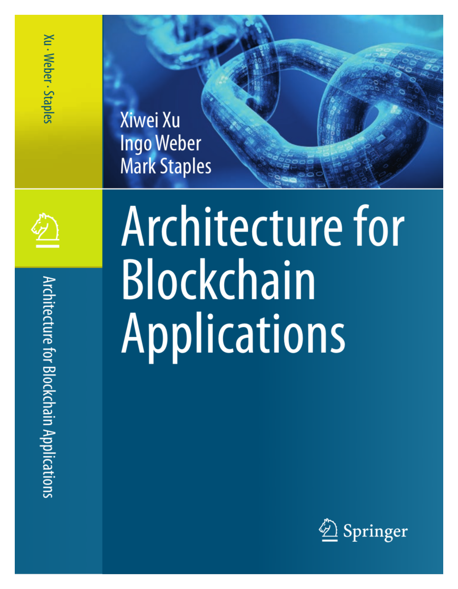

--- 
title: "Architecture for Blockchain Applications"
author: "Xiwei (Sherry) Xu, Ingo Weber, Mark Staples"
site: bookdown::bookdown_site
output: bookdown::gitbook
documentclass: book
bibliography: [book.bib, packages.bib]
biblio-style: apalike
link-citations: yes
github-repo: ingo-weber/blockchain-architecture
description: "This is the companion website for the book *Architecture for Blockchain Applications*."
favicon: images/favicon.ico
---

# Home

This website accompanies the book "Architecture for Blockchain Applications".
Here we provide [teaching materials](#materials) from courses based on the book.
The book is available through [Springer](http://dx.doi.org/10.1007/978-3-030-03035-3), [Amazon](https://www.amazon.com/Architecture-Blockchain-Applications-Xiwei-Xu/dp/3030030342/ref=as_sl_pc_tf_til?tag=imweber-20&linkCode=w00&linkId=158d278157c47e99c46916ed9fdc5387&creativeASIN=3030030342), and other bookstores.
Many university libraries have access to it.

* Xiwei Xu, Ingo Weber, and Mark Staples. *Architecture for Blockchain Applications*. Springer, 2019.

The website also contains information about the [authors](#authors) and [links to related websites](#links).

## About the book

This book addresses what software architects and developers need to know in order to build applications based on blockchain technology, by offering an architectural view of software systems that make beneficial use of blockchains. It provides guidance on assessing the suitability of blockchain, on the roles blockchain can play in an architecture, on designing blockchain applications, and on assessing different architecture designs and tradeoffs. It also serves as a reference on blockchain design patterns and design analysis, and refers to practical examples of blockchain-based applications.

The book is divided into four parts: Part I provides a general introduction to the topic and to existing blockchain platforms including Bitcoin, Ethereum, and Hyperledger Fabric, and offers examples of blockchain-based applications. Part II focuses on the functional aspects of software architecture, describing the main roles blockchain can play in an architecture, as well as its potential suitability and design process. It includes a catalogue of 15 design patterns and details how to use model-driven engineering to build blockchain-based applications. Part III covers the non-functional aspects of blockchain applications, which are cross-cutting concerns including cost, performance, security, and availability. Part IV then presents three detailed real-world use cases, offering additional insights from a practical perspective. An epilogue summarizes the book and speculates on the role blockchain and its applications can play in the future.

This book focusses on the bigger picture for blockchain, covering the concepts and technical considerations in the design of blockchain-based applications. The use of mathematical formulas is limited to where they are critical. This book is primarily intended for developers, software architects and chief information officers who need to understand the basic technology, tools and methodologies to build blockchain applications. It also provides students and researchers new to this field an introduction to this hot topic.

## Keywords

* Blockchain 
* Software Architecture 
* Bitcoin
* Ethereum
* Hyperledger Fabric
* Information Systems Applications
* Software Functional Properties
* Non-Functional Properties
* Distributed Transactions 
